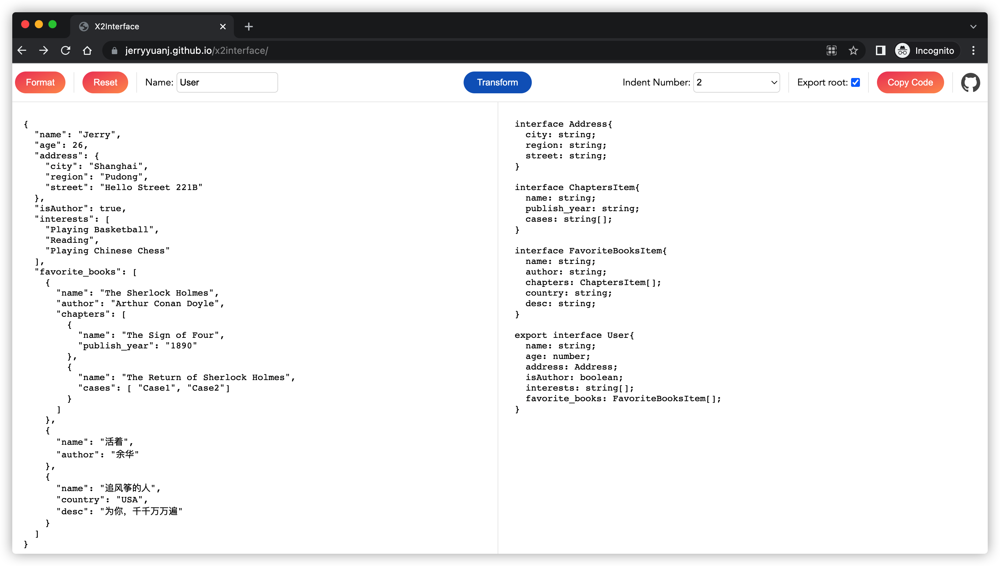

## X2Interface

This is a small tool for developers which can generate typescript interfaces definition from JSON or JS object.

## Features

- Cleaner UI with configurable options
- Support both JS and JSON schema
- Handle nested objects
- Formatted input and output

## Screenshot

